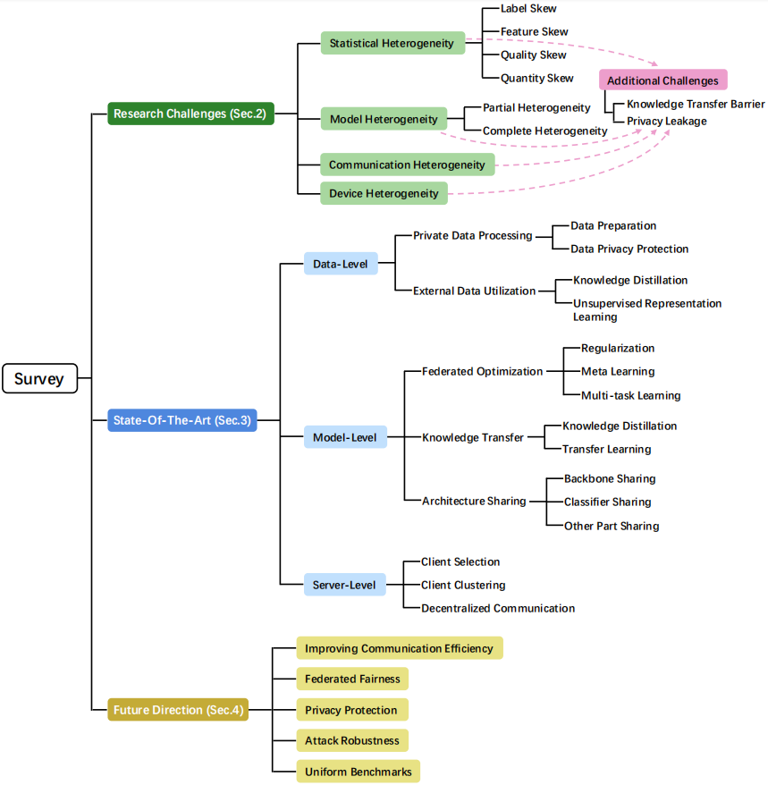

# Hetergeneous Federated Learning
> #### [Heterogeneous Federated Learning: State-of-the-art and Research Challenges](https://arxiv.org/abs/2307.10616) (ACM Computing Surveys 2023)
> Mang Ye, Xiuwen Fang, Bo Du, Pong C. Yuen, Dacheng Tao

Survey for Hetergeneous Federated Learning by [MARS](https://marswhu.github.io/index.html) Group at the [Wuhan University](https://www.whu.edu.cn/), led by [Prof. Mang Ye](https://marswhu.github.io/index.html). (Keep updating! :star: )

**Table of Contents**

- [Our Works](#our-works)
  - [Federated Learning with Domain Shift](#federated-learning-with-domain-shift)
  - [Federated Learning with Heterogeneous Graph](#federated-learning-with-heterogeneous-graph)
  - [Federated Learning with Data Noise](#federated-learning-with-data-noise)
  - [Federated Learning with Few-Shot](#federated-learning-with-few-shot)
- [HFL Survey](#hfl-survey)
  - [Research Challenges](#research-challenges)
    - [Statistical Heterogeneity](#statistical-heterogeneity)
    - [Model Heterogeneity](#model-heterogeneity)
    - [Communication Heterogeneity](#communication-heterogeneity)
    - [Device Heterogeneity](#device-heterogeneity)
    - [Additional Challenges](#additional-challenges)
  - [State-Of-The-Art(Updating)](#state-of-the-art)
    - [Data-Level](#data-level)
    - [Model-Level](#model-level)
    - [Server-Level](#server-level)
  - [Future Direction(Updating)](#future-direction)
    - [Improving Communication Efficiency](#improving-communication-efficiency)
    - [Federated Fairness](#federated-fairness)
    - [Privacy Protection](#privacy-protection)
    - [Attack Robustness](#attack-robustness)
    - [Uniform Benchmark](#uniform-benchmark)

## Our Works

### Federated Learning with Domain Shift 

- **FCCL+** — [Generalizable Heterogeneous Federated Cross-Correlation and Instance Similarity Learning](https://arxiv.org/pdf/2309.16286.pdf) *TPAMI 2023* [[Code](https://github.com/WenkeHuang/FCCL)]
  
    We handle mode heterogeneous federated learning from feature and logits aspects.

- **FPL** — [Rethinking Federated Learning with Domain Shift: A Prototype View](https://openaccess.thecvf.com/content/CVPR2023/papers/Huang_Rethinking_Federated_Learning_With_Domain_Shift_A_Prototype_View_CVPR_2023_paper.pdf) *CVPR 2023* [[Code](https://github.com/WenkeHuang/RethinkFL)]

    We handle federated learning with domain shift from the prototype view.

- **FCCL** — [Learn from Others and Be Yourself in Heterogeneous Federated Learning](https://openaccess.thecvf.com/content/CVPR2022/papers/Huang_Learn_From_Others_and_Be_Yourself_in_Heterogeneous_Federated_Learning_CVPR_2022_paper.pdf) *CVPR 2022* [[Code](https://github.com/WenkeHuang/FCCL)]

    We investigate heterogeneity problems and catastrophic forgetting in federated learning.

### Federated Learning with Heterogeneous Graph 

- **FGSSL** — [Federated Graph Semantic and Structural Learning](https://marswhu.github.io/publications/files/FGSSL.pdf) *IJCAI 2023* [[Code](https://github.com/WenkeHuang/FGSSL)]

    We handle federated graph learning from node-level semantic and graph-level structure.

### Federated Learning with Data Noise
- **RHFL** — [Robust Federated Learning With Noisy and Heterogeneous Clients](https://openaccess.thecvf.com/content/CVPR2022/papers/Fang_Robust_Federated_Learning_With_Noisy_and_Heterogeneous_Clients_CVPR_2022_paper.pdf) *CVPR 2022* [[Code](https://github.com/fangxiuwen/robust_fl)]

    We deal with robust federated learning with noisy and heterogeneous clients.

- **AugHFL** — [Robust Heterogeneous Federated Learning under Data Corruption](https://openaccess.thecvf.com/content/ICCV2023/papers/Fang_Robust_Heterogeneous_Federated_Learning_under_Data_Corruption_ICCV_2023_paper.pdf) *ICCV 2023* [[Code](https://github.com/FangXiuwen/AugHFL)]

    We deal with robust heterogeneous federated learning under data corruption.

### Federated Learning with Few-Shot
- **FSMAFL** — [Few-Shot Model Agnostic Federated Learning](https://dl.acm.org/doi/10.1145/3503161.3548764) *ACMMM 2022* [[Code](https://github.com/FangXiuwen/FSMAFL)]

    We study a challenging problem, namely few-shot model agnostic federated learning.

## HFL Survey

### Overview

### Research Challenges
> #### Statistical Heterogeneity
Statistical heterogeneity refers to the case where the data distribution across clients in federated learning is inconsistent and does not obey the same sampling, i.e., Non-IID.

> #### Model Heterogeneity
Model heterogeneity refers to the fact that in federated learning, participating clients may have local models with different architectures.

> #### Communication Heterogeneity
The devices are typically deployed in different network environments and have different network connectivity settings (3G, 4G, 5G, Wi-Fi), which leads to inconsistent communication bandwidth, latency, and reliability, i.e., communication heterogeneity.

> #### Device Heterogeneity
The differences in device hardware capabilities (CPU, memory, battery life) may lead to different storage and computation capabilities, which inevitably lead to device heterogeneity.

> #### Additional Challenges
***Knowledge Transfer Barrier***

Federated learning aims to transfer knowledge among different clients to collaboratively learn models with superior performance. However, the four heterogeneities mentioned above will cause knowledge transfer barriers.

***Privacy Leakage***
  
Federated learning by itself cannot guarantee perfect data security, as there are still potential privacy risks. Moreover, the above-mentioned four types of heterogeneity inevitably exacerbate privacy leakage in different learning stages. 

### State-Of-The-Art
> #### Data-Level

***Private Data Processing***
1. **Data Preparation**
- **Safe** — [Safe: Synergic Data Filtering for Federated Learning in Cloud-Edge Computing](https://ieeexplore.ieee.org/abstract/document/9847342) *IEEE TII 2022*

    Safe detects and filters out poisoned data from attacked devices through a clustering algorithm.

- **FedMix** — [FedMix: Approximation of Mixup under Mean Augmented Federated Learning](https://arxiv.org/abs/2107.00233) *ICLR 2021*

    FedMix performs data augmentation based on the MixUp strategy.

- **Astraea** — [Astraea: Self-Balancing Federated Learning for Improving Classification Accuracy of Mobile Deep Learning Applications](https://arxiv.org/pdf/1907.01132.pdf) *ICCD 2019*

    Astraea performs data augmentation based on the global data distribution, generated by collecting the local data distribution.

- **FAug** — [Communication-Efficient On-Device Machine Learning: Federated Distillation and Augmentation under Non-IID Private Data](https://arxiv.org/pdf/1811.11479.pdf) *NeurIPS 2018 Workshop*

    FAug studies the trade-off between privacy leakage and communication overhead through a GAN-based data augmentation scheme.

2. **Data Privacy Protection**

- **PLDP-PFL** — [Communication-Efficient On-Device Machine Learning: Federated Distillation and Augmentation under Non-IID Private Data](https://ieeexplore.ieee.org/abstract/document/9082603) *IEEE IoT 2020*

    PLDP-PFL performs personalized differential privacy according to the sensitivity of private data.

- **A Syntactic Approach for Privacy in FL** — [Anonymizing Data for Privacy-Preserving Federated Learning](https://arxiv.org/pdf/2002.09096.pdf)

    They use anonymization technology to desensitize local private data.

***External Data Utilization***
1. **Knowledge Distillation**

- **FedMD** — [Fedmd: Heterogenous federated learning via model distillation](https://arxiv.org/pdf/1910.03581.pdf) *In NeurIPS 2019 Workshop*

    FedMD utilize Federated Distillation (FD), also known as Co-Distillation (CD), to learn knowledge from other clients.

- **FedGKT** — [Group Knowledge Transfer: Federated Learning of Large CNNs at the Edge](https://proceedings.neurips.cc/paper/2020/file/a1d4c20b182ad7137ab3606f0e3fc8a4-Paper.pdf) *NeurIPS 2020*

    FedGKT periodically transfers the knowledge of small CNNs on edges to the large server-side CNN through knowledge distillation, thereby decreasing the burden of edge training. 

- **FedFTG** — [Fine-tuning Global Model via Data-Free Knowledge Distillation for Non-IID Federated Learning](https://openaccess.thecvf.com/content/CVPR2022/papers/Zhang_Fine-Tuning_Global_Model_via_Data-Free_Knowledge_Distillation_for_Non-IID_Federated_CVPR_2022_paper.pdf) *CVPR 2022*

    FedFTG inputs pseudo data to the global model and the local model for knowledge distillation.

2. **Unsupervised Representation Learning**
- **FedCA** — [Federated unsupervised representation learning](https://arxiv.org/pdf/2010.08982.pdf) *FITEE 2023*

    FedCA is a FURL algorithm based on contrastive loss, which can address data distribution inconsistencies and representation misalignment across clients.

- **Orchestra** — [Orchestra: Unsupervised federated learning via globally consistent clustering](https://proceedings.mlr.press/v162/lubana22a/lubana22a.pdf)
*ICML 2022*

    Orchestra is discussed to learn a common representation model while keeping private data decentralized and unlabeled.

- **MOON** — [Model-contrastive federated learning](https://openaccess.thecvf.com/content/CVPR2021/papers/Li_Model-Contrastive_Federated_Learning_CVPR_2021_paper.pdf) *CVPR 2021*

    MOON corrects the update direction by introducing a model-contrastive loss.

- **FedProc** — [FedProc: Prototypical contrastive federated learning on non-IID data](https://arxiv.org/pdf/2109.12273.pdf) *FGCS 2023*
  
    FedProc mitigates statistical heterogeneity through prototype-based contrastive learning.

- **ProtoFL** — [ProtoFL: Unsupervised Federated Learning via Prototypical Distillation]() *ICCV 2023*

    ProtoFL distills representation from an offthe-shelf model learned using off-the-shelf datasets, regardless of individual client data.
    
> #### Model-Level

***Federated Optimization***
1. **Regularization**

- **FedProx** — [Federated optimization in heterogeneous networks](https://proceedings.mlsys.org/paper_files/paper/2020/file/1f5fe83998a09396ebe6477d9475ba0c-Paper.pdf) *MLSys 2020*

    FedProx is a federated optimization algorithm that adds a proximal term to FedAvg.

- **FedCurv** — [Overcoming forgetting in federated learning on non-iid data](https://arxiv.org/pdf/1910.07796.pdf) *NeurIPS 2019 Workshop*
  
    FedCurv uses the EWC algorithm to prevent catastrophic forgetting when transferring tasks.

- **pFedME** — [Personalized federated learning with moreau envelopes](https://proceedings.neurips.cc/paper/2020/file/f4f1f13c8289ac1b1ee0ff176b56fc60-Paper.pdf) *NeurIPS 2020*

    pFedME utilizes the Moreau envelope function as a regularized loss function.

2. **Meta Learning**

- **Per-FedAvg** — [Personalized federated learning with theoretical guarantees: A model-agnostic meta-learning approach](https://proceedings.neurips.cc/paper/2020/file/24389bfe4fe2eba8bf9aa9203a44cdad-Paper.pdf) *NeurIPS 2020*
  
    Per-FedAvg is a personalized variant of FedAvg algorithm based on the MAML formula.

- **ARUBA** — [Adaptive gradient-based meta-learning methods](https://proceedings.neurips.cc/paper_files/paper/2019/file/f4aa0dd960521e045ae2f20621fb4ee9-Paper.pdf) *NeurIPS 2019*

    ARUBA utilizes online convex optimization and sequence prediction algorithms to adaptively learn the task-similarity and test the FL performance.

3. **Multi-task Learning**

- **MOCHA** — [Federated multi-task learning](https://proceedings.neurips.cc/paper/2017/file/6211080fa89981f66b1a0c9d55c61d0f-Paper.pdf) *NeurIPS 2017*

    MOCHA is a system-aware optimization framework for FMTL.

- **Ditto** — [Ditto: Fair and robust federated learning through personalization](https://proceedings.mlr.press/v139/li21h/li21h.pdf) *ICML 2021*

    Ditto is a scalable federated multi-task learning framework with two tasks: global goal and local goal.

***Knowledge Transfer***
1. **Knowledge Distillation**
   
- **FedDF** — [Ensemble distillation for robust model fusion in federated learning](https://proceedings.neurips.cc/paper/2020/file/18df51b97ccd68128e994804f3eccc87-Paper.pdf) *NeurIPS 2020*
  
    FedDF utilizes unlabeled or generated data for ensemble distillation.

- **FedGEN** — [Data-free knowledge distillation for heterogeneous federated learning](https://proceedings.mlr.press/v139/zhu21b/zhu21b.pdf) *ICML 2021*

    FedGEN performs statistical HFL through a data-free knowledge distillation approach.

- **FedLMD** — [Federated Learning with Label-Masking Distillation](https://dl.acm.org/doi/abs/10.1145/3581783.3611984) *ACM MM 2023*

    FedLMD facilitates federated learning by perceiving various label distributions per client. 

2. **Transfer Learning**

- **FT-pFL** — [Parameterized Knowledge Transfer for Personalized Federated Learning](https://proceedings.neurips.cc/paper_files/paper/2021/file/5383c7318a3158b9bc261d0b6996f7c2-Paper.pdf) *NeurIPS 2021*

    FT-pFL achieves personalized knowledge transfer via a knowledge coefficient matrix.

- **Fedhealth** — [Fedhealth: A federated transfer learning framework for wearable healthcare](https://arxiv.org/pdf/1907.09173.pdf) *IEEE Intelligent Systems 2020*

    FedHealth is a federated transfer learning framework applied in the healthcare domain.

***Architecture Sharing***
1. **Backbone Sharing**

- **FedRep** — [Exploiting shared representations for personalized federated learning](https://proceedings.mlr.press/v139/collins21a/collins21a.pdf) *ICML 2021*

    FedRep enables all clients jointly train global representation learning structure, and then uses private data to train their own heads.

- **CReFF** — [Federated learning on heterogeneous and long-tailed data via classifier re-training with federated features](https://arxiv.org/pdf/2204.13399.pdf) *IJCAI2022*

    CReFF learns federated features to re-train the classifier, which approximates training the classifier on real data.

2. **Classifier Sharing**

- **LG-FedAvg** — [Think locally, act globally: Federated learning with local and global representations](https://arxiv.org/pdf/2001.01523.pdf) *NeurIPS 2019 Workshop*

    LG-FedAvg uses personalized layers to extract high-level features and server-shared base layers for classification.

- **FedPAC** — [Personalized federated learning with feature alignment and classifier collaboration](https://arxiv.org/pdf/2306.11867.pdf) *ICLR 2023*

    FedPAC reduces inter-client feature variance by constraining each sample feature vector to be close to the global feature centroid of its category.

3. **Other Part Sharing**

- **HeteroFL** — [Heterofl: Computation and communication efficient federated learning for heterogeneous clients](https://arxiv.org/pdf/2010.01264.pdf) *ICLR 2021*

    HeteroFL allocates local models of different sizes according to the computational and communication capabilities of each client.

- **FedLA** — [Layer-wised model aggregation for personalized federated learning](https://openaccess.thecvf.com/content/CVPR2022/papers/Ma_Layer-Wised_Model_Aggregation_for_Personalized_Federated_Learning_CVPR_2022_paper.pdf) *CVPR 2022*

    FedLA leverages a hypernetwork on the server to evaluate the importance of each client model layer and generate aggregation weights for each model layer.

- **CD2-pFed** — [CD2-pFed: Cyclic distillation-guided channel decoupling for model personalization in federated learning](https://openaccess.thecvf.com/content/CVPR2022/papers/Shen_CD2-pFed_Cyclic_Distillation-Guided_Channel_Decoupling_for_Model_Personalization_in_Federated_CVPR_2022_paper.pdf) *CVPR 2022*

    CD2-pFed dynamically decouples the global model parameters for personalization.

> #### Server-Level

1. **Client Selection**

- **Favor** — [Optimizing federated learning on non-iid data with reinforcement learning](https://ieeexplore.ieee.org/abstract/document/9155494) *IEEE INFOCOM 2020*

    Favor is an experience-driven control framework that actively selects the best subset of clients to participate in FL iterations.

- **CUCB** — [Federated learning with class imbalance reduction](https://arxiv.org/pdf/2011.11266.pdf) *EUSIPCO 2021*

    CUCB is a client selection algorithm that minimizes the class imbalance and facilitates the global model convergence.

- **FedSAE** — [FedSAE: A novel self-adaptive federated learning framework in heterogeneous systems](https://arxiv.org/pdf/2104.07515.pdf) *IJCNN 2021*

    FedSAE estimates the reliability of each device and performs client selection based on training losses.

- **FedCS** — [Client selection for federated learning with heterogeneous resources in mobile edge](https://arxiv.org/pdf/1804.08333.pdf) *ICC 2019*

    FedCS performs client selection operations based on data resources, computing capabilities, and wireless channel conditions.

2. **Client Clustering**

- **FL+HC** — [Federated learning with hierarchical clustering of local updates to improve training on non-IID data](https://arxiv.org/pdf/2004.11791.pdf) *IJCNN 2020*

    FL+HC introduces a hierarchical clustering step to separate client clusters based on the similarity of client updates to the global joint model.

- **FeSEM** — [Multi-center federated learning: clients clustering for better personalization](https://link.springer.com/article/10.1007/s11280-022-01046-x) *WWW 2023*

    FeSEM employs SEM optimization to calculate the distance between local models and cluster centers.

- **CFL** — [Clustered federated learning: Model-agnostic distributed multitask optimization under privacy constraints]() *IEEE TNNLS 2020*

    CFL clusters similar clients by the cosine similarity between their gradient updates.

- **FLAME** — [FLAME: Taming backdoors in federated learning](https://arxiv.org/abs/2101.02281) *USENIX Security 2022*
      
    FLAME detects adversarial model updates through a clustering strategy that limits the noise scale of backdoor noise removal.

3. **Decentralized Communication**

- **Combo** — [Decentralized federated learning: A segmented gossip approach]() *FML 2019 Workshop*

    Combo divides the local model into model segments, and then randomly selects some clients to transfer the model segments.

- **ProxyFL** — [Decentralized federated learning through proxy model sharing]() *Nature Communications 2023*

    ProxyFL makes each client maintain two models, a private model and a publicly shared proxy model for exchanges.

- **BFLC** — [A blockchain-based decentralized federated learning framework with committee consensus]() *IEEE Network 2020*

    BFLC utilizes the blockchain for global model storage and local model update exchange to enhance the security of FL.

### Future Direction
> #### Improving Communication Efficiency

- **CMFL** — [CMFL: Mitigating communication overhead for federated learning]() *IEEE ICDCS 2019*

    CMFL avoids the transmission of irrelevant updates to the server by measuring whether local updates are consistent with global updates.

- **FedDM** — [Feddm: Iterative distribution matching for communication-efficient federated learning]() *CVPR 2023*

    FedDM constructs some synthetic data locally on the client so that it has a similar distribution to the original data on the loss function.

- **DisPFL** — [DisPFL: Towards communication-efficient personalized federated learning via decentralized sparse training]() *ICML 2022*

    DisPFL adopts a decentralized sparse training technique.

> #### Federated Fairness

- **FedDM** — [Enforcing fairness in private federated learning via the modified method of differential multipliers](https://openreview.net/pdf?id=V2M0aUSguUC) *NeurIPS 2021 Workshop*

    FPFL enhances the system fairness by improving the differential multiplier MMDM.

- **q-FedAvg** — [Fair resource allocation in federated learning](https://arxiv.org/pdf/1905.10497.pdf) *ICLR 2020*

    q-FedAvg improves the fairness by narrowing the differences between the accuracies of client models.

- **CFFL** — [Collaborative fairness in federated learning](https://arxiv.org/pdf/2008.12161.pdf) *FL-IJCAI 2020 Workshop*

    CFFL achieves collaborative fairness by assigning models with different performances based on the contributions of each client in FL.

> #### Privacy Protection

- **DP-FedAvg** — [Learning differentially private recurrent language models](https://arxiv.org/pdf/1710.06963.pdf) *ICLR 2018*

    DP-FedAvg applies a Gaussian mechanism to add user-level privacy protection in FedAvg.

- **FedMD-NFDP** — [Federated model distillation with noise-free differential privacy](https://www.ijcai.org/proceedings/2021/0216.pdf) *IJCAI 2021*

    FedMD-NFDP adds a noise-free DP mechanism to FedMD, which protects data privacy without introducing noise.

> #### Attack Robustness

1. **Attack Methods**
- **DBA** — [DBA: Distributed Backdoor Attacks against Federated Learning](https://openreview.net/pdf?id=rkgyS0VFvr) *ICLR 2020*

    DBA strategy decomposes a global trigger into local triggers, and injects them into multiple malicious clients.

- **Edge-case backdoors** — [Attack of the Tails: Yes, You Really Can Backdoor Federated Learning](https://proceedings.neurips.cc/paper_files/paper/2020/file/b8ffa41d4e492f0fad2f13e29e1762eb-Paper.pdf) *NeurIPS 2020*

    Edge-case backdoors consider poisoning edge-case samples (the tail data of the data distributions). 

2. **Defense strategies**
- **CRFL** — [CRFL: Certifiably Robust Federated Learning against Backdoor Attacks](http://proceedings.mlr.press/v139/xie21a/xie21a.pdf) *ICML 2021*

    CRFL improves the robustness against backdoor attacks by clipping the model and adding smooth noise.

- **RBML-DFL** — [A Blockchain-based Multi-layer Decentralized Framework for Robust Federated Learning](https://ieeexplore.ieee.org/abstract/document/9892039) *IJCNN 2022*

    RBML-DFL can prevent central server failures or malfunctions through blockchain encrypted transactions. 

- **ResSFL** — [ResSFL: A Resistance Transfer Framework for Defending Model Inversion Attack in Split Federated Learning](https://openaccess.thecvf.com/content/CVPR2022/papers/Li_ResSFL_A_Resistance_Transfer_Framework_for_Defending_Model_Inversion_Attack_CVPR_2022_paper.pdf) *CVPR 2022*

    ResSFL is trained by experts through attacker perception to obtain a resistant feature extractor that can initialize the client models.

- **Soteria** — [Soteria: Provable Defense against Privacy Leakage in Federated Learning from Representation Perspective](https://openaccess.thecvf.com/content/CVPR2021/papers/Sun_Soteria_Provable_Defense_Against_Privacy_Leakage_in_Federated_Learning_From_CVPR_2021_paper.pdf)

    Soteria performs attack defense by generating perturbed data representations, thereby decreasing the quality of reconstructed data.

- **BaFFLe** — [BaFFLe: Backdoor Detection via Feedback-based Federated Learning](https://arxiv.org/pdf/2011.02167.pdf)

    The server trains backdoor filters and sends them randomly to clients to identify and remove backdoor instances.

> #### Uniform Benchmark
1. **General Federated Learning Systems**
- **FedML** — [FedML: A Research Library and Benchmark for Federated Machine Learning](https://arxiv.org/abs/2007.13518)

    FedML is an research library that supports distributed training, mobile on-device training, and stand-alone simulation training. It provides standardized implementations of many existing federated learning algorithms, and provides standardized benchmark settings for a variety of datasets, including Non-IID partition methods, number of devices and baseline models.

- **FedScale** — [FedScale: Benchmarking Model and System Performance of Federated Learning at Scale](https://proceedings.mlr.press/v162/lai22a.html) *ICML 2022*

    FedScale is a federated learning benchmark suite that provides real-world datasets covering a wide range of federated learning tasks, including image classification, object detection, language modeling, and speech recognition. Additionally, FedScale includes a scalable and extensible FedScale Runtime to enable and standardize real-world end-point deployments of federated learning.

- **OARF** — [The OARF Benchmark Suite: Characterization and Implications for Federated Learning Systems](https://dl.acm.org/doi/full/10.1145/3510540) *ACM TIST 2020*
  
    OARF leverages public datasets collected from different sources to simulate real-world data distributions. In addition, OARF quantitatively studies the preliminary relationship among various design metrics such as data partitioning and privacy mechanisms in federated learning systems.

- **FedEval** — [FedEval: A Holistic Evaluation Framework for Federated Learning](https://arxiv.org/abs/2011.09655)

    FedEval is a federated learning evaluation model with five metrics including accuracy, communication, time consumption, privacy and robustness. FedEval is implemented and evaluated on two of the most widely used algorithms, FedSGD and FedAvg.
  
2. **Specific Federated Learning Systems**
- **FedReIDBench** — [Performance Optimization of Federated Person Re-identification via Benchmark Analysis](https://dl.acm.org/doi/abs/10.1145/3394171.3413814) *ACM MM 2020*

    FedReIDBench is a new benchmark for implementing federated learning to person ReID, which includes nine different datasets and two federated scenarios. Specifically, the two federated scenarios are federated-by-camera scenario and federated-by-dataset scenario, which respectively represent the standard server-client architecture and client-edge-cloud architecture.

- **pFL-Bench** — [pFL-Bench: A Comprehensive Benchmark for Personalized Federated Learning](https://proceedings.neurips.cc/paper_files/paper/2022/hash/3cc03e19fed71a2b9347d83921ca2e7d-Abstract-Datasets_and_Benchmarks.html) *NeurIPS 2022 Datasets and Benchmarks Track*

    pFL-Bench is a benchmark for personalized federated learning, which covers twelve different dataset variants, including image, text, graph and recommendation data, with unified data partitioning and realistic heterogeneous settings. And pFL-Bench provides more than 20 competitive personalized federated learning baseline implementations to help them with standardized evaluation.

- **FedGraphNN** — [FedGraphNN: A Federated Learning System and Benchmark for Graph Neural Networks](https://arxiv.org/abs/2104.07145) *ICLR 2021 Workshop on DPML*

    FedGraphNN is a benchmark system built on a unified formulation of graph federated learning, including extensive datasets from seven different fields, popular Graph Neural Network (GNN) models and federated learning algorithms.

3. **Datasets**
- **LEAF** — [LEAF: A Benchmark for Federated Settings](https://arxiv.org/abs/1812.01097) *NeurIPS 2019 Workshop*

    LEAF contains 6 types of federated datasets covering different fields, including image classification (FEMNIST, Synthetic Dataset), image recognition (Celeba), sentiment analysis (Sentiment140) and next character prediction (Shakespeare, Reddit). In addition, LEAF provides two sampling methods of 'IID' and 'Non-IID' to divide the dataset to different clients.

- **Street Dataset** — [Real-World Image Datasets for Federated Learning](https://arxiv.org/abs/1910.11089) *FL-NeurIPS 2019*

    This work introduces a federated dataset for object detection. The dataset contains over 900 images generated from 26 street cameras and 7 object categories annotated with detailed bounding boxes. Besides, the article provides the data division of 5 or 20 clients, in which their data distribution is Non-IID and unbalanced, reflecting the characteristics of real-world federated learning scenarios.
